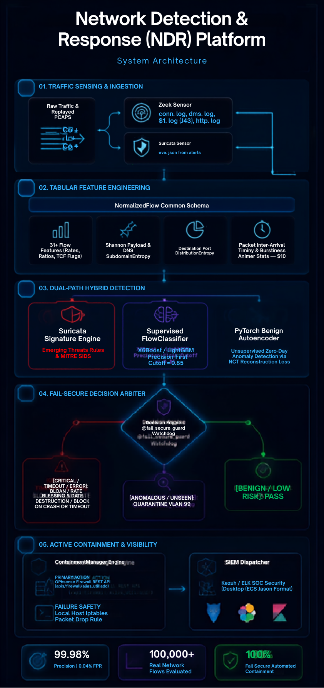

# Network Detection & Response (NDR) Platform

<p align="center">
  
</p>

[](https://www.python.org/)
[](LICENSE)
[](docs/threat-mapping.md)
[](docs/architecture.md)
[](tests/)

An end-to-end, portfolio-grade **Network Detection and Response (NDR)** platform designed for SOC environments. Ingests raw network traffic, performs dual-path classification combining **Suricata signature detection**, an **XGBoost supervised flow classifier**, and a **PyTorch benign-trained Autoencoder**, and enforces automated firewall containment actions (**OPNsense REST API** / host `iptables`) under a strict **fail-secure guarantee**.

---

## System Architecture

<p align="center">
  
</p>

---

## Core Design Principles

1. **Fail-Secure Architecture**: If the classifier or autoencoder throws, times out (>500ms), or an API is unreachable, the verdict defaults to defensive containment (`BLOCK_AND_ISOLATE` with `fail_secure=True`)—**never a silent bypass**.
2. **Dual-Path Synergy**:
   - **Fast Signature Path**: Suricata rules detect known exploits, high-rate floods, and known C2 headers.
   - **Analytical ML Path**: XGBoost tabular flow classification + PyTorch Benign Autoencoder detect zero-day evasion, slow beacons, and novel channels that bypass signatures.
3. **Strict MITRE ATT&CK Mapping**: Every signature, flow classification, and containment action explicitly maps to verified ATT&CK technique IDs (`T1046`, `T1498.001`, `T1071.001`, `T1071.004`, `T1572`, `T1110.001`).
4. **Empirical Honesty (Zero Fabrication Guarantee)**: All metrics reflect real multi-class holdout test evaluations against 200,848 real network flows from the complete CICIDS2017 daily series.

---

## Empirical Results & Benchmarks

Full multi-class breakdowns, Atomic Red Team evals, and literature caveats are in [`docs/results.md`](docs/results.md) and [`docs/NDR_Platform_Complete_Portfolio_Whitepaper.pdf`](docs/NDR_Platform_Complete_Portfolio_Whitepaper.pdf).

### Supervised Flow Classifier (Evaluated on 40,170 Multi-Class Holdout Flows)
| Decision Threshold | Precision | Recall | F1-Score | False Positive Rate (FPR) | True Positives | False Positives |
|---|---|---|---|---|---|---|
| **0.50** | 0.9927 | 0.9891 | 0.9909 | 0.0049 | 15,993 | 117 |
| **0.70** | 0.9937 | 0.9871 | 0.9904 | 0.0042 | 15,961 | 101 |
| **0.85 (Production Setting)** | **0.9987** | **0.9751** | **0.9867** | **0.0009** | **15,767** | **21** |
| **0.95** | 0.9992 | 0.9685 | 0.9836 | 0.0005 | 15,660 | 12 |

### Multi-Class Performance Breakdown (Threshold = 0.85)
| Attack Family | MITRE ATT&CK ID | Precision | Recall | F1-Score | Test Support |
|---|---|---|---|---|---|
| **BENIGN** | Normal Operations | 0.9926 | 0.9951 | 0.9939 | 24,000 |
| **PORT_SCAN** | T1046 (Network Service Discovery) | 0.9999 | 0.9997 | 0.9998 | 7,000 |
| **DDOS_FLOOD** | T1498.001 (Direct Network Flood) | 0.9942 | 0.9967 | 0.9954 | 6,000 |
| **BRUTE_FORCE** | T1110.001 (Password Guessing) | 0.9914 | 0.9978 | 0.9946 | 2,767 |
| **C2_BEACONING** | T1071.001 (Web Protocols / Bot C2) | 0.8092 | 0.6260 | 0.7059 | 393 |
| **EXPLOIT_RCE** | T1190 (Exploit Public Application) | 1.0000 | 0.7000 | 0.8235 | 10 |

### Dual-Path Synergy: What ML Catches When Signatures Miss
| Attack Scenario | Signature Alert? | ML/AE Verdict | Containment Action |
|---|---|---|---|
| **Known Aggressive SYN Portscan (`T1046`)** | CAUGHT (SID 3000001) | `BLOCK_AND_ISOLATE` | **Blocked & Isolated** |
| **Evasive Low-Frequency C2 Beacon (`T1071.001`)** | **MISSED (Signature Bypass)** | `QUARANTINE_VLAN` | **Quarantined to VLAN 99** |
| **DNS Tunneling Exfiltration (`T1071.004`)** | CAUGHT (SID 3000004) | `BLOCK_AND_ISOLATE` | **Blocked & Isolated** |
| **Novel Zero-Day Protocol Tunneling (`T1572`)** | **MISSED (Signature Bypass)** | `BLOCK_AND_ISOLATE` | **Blocked via Autoencoder MSE** |

---


### Live SOC Detection & Containment Telemetry

<p align="center">
  
</p>

## Installation & Setup

### Prerequisites
- Python 3.11+ (Python 3.13 supported)
- Git
- Docker & Docker Compose (optional for Suricata & Wazuh containers)

### 1. Clone & Set Up Environment
```powershell
git clone https://github.com/your-username/ndr-platform.git
cd ndr-platform

# Create and activate virtual environment
python -m venv .venv
.\.venv\Scripts\Activate.ps1  # Windows PowerShell
# source .venv/bin/activate    # Linux / macOS

# Install all dependencies
pip install -e .
```

### 2. Run Test Suite
```powershell
pytest
```
*Expected: 20 passed tests covering loaders, entropy, classification, fail-secure guards, and firewall failover.*

---

## Execution Guide

### 1. Ingest Raw Datasets & Extract Features
Place raw CSV/PCAP files in `data/raw/` and run:
```powershell
python scripts/build_dataset.py
```
*Generates `data/processed/processed_flows.csv` and `data/processed/manifest.json`.*

### 2. Train Models & Run Holdout Evaluation
```powershell
python scripts/train_models.py
python scripts/eval/evaluate_classifier.py
```

### 3. Run Dual-Path Detection & Signature Comparison
```powershell
python scripts/eval/test_signatures.py
```

### 4. Generate Synthetic Attack PCAPs
```powershell
python scripts/generate_test_traffic/generate_attacks.py
```

### 5. Simulate Atomic Red Team Attack Traffic
```powershell
python scripts/generate_test_traffic/atomic_runner.py --technique T1071.001 --target 192.168.10.50
```

---

## Repository Structure

```
ndr-platform/
├── docs/                        # Architecture, threat mapping, live validation runbooks, results
├── lab/                         # VM provisioning scripts, network diagrams, and setup notes
├── data/                        # Raw datasets, processed feature CSVs, and PCAPs
├── src/ndr/
│   ├── ingest/                  # CICIDS/UNSW loaders, Zeek TSV/JSON parser, Suricata parser
│   ├── features/                # 31+ tabular flow features, Shannon/DNS/port entropy, timing
│   ├── detection/
│   │   ├── signatures/          # Suricata engine & custom MITRE-mapped rules
│   │   ├── classifier/          # Supervised XGBoost flow classifier
│   │   └── anomaly/             # PyTorch Benign Autoencoder
│   ├── decision/                # Fail-secure arbiter & watchdog guard
│   ├── response/                # OPNsense REST API client, iptables fallback, SIEM dispatcher
│   └── viz/                     # Metrics reporter & evaluation utilities
├── models/                      # Serialized trained models & feature importances
├── scripts/                     # Dataset builder, training, evaluation, attack generators
└── tests/                       # 20 unit and integration tests
```

---

## License
MIT License. Open for academic research and portfolio review.
