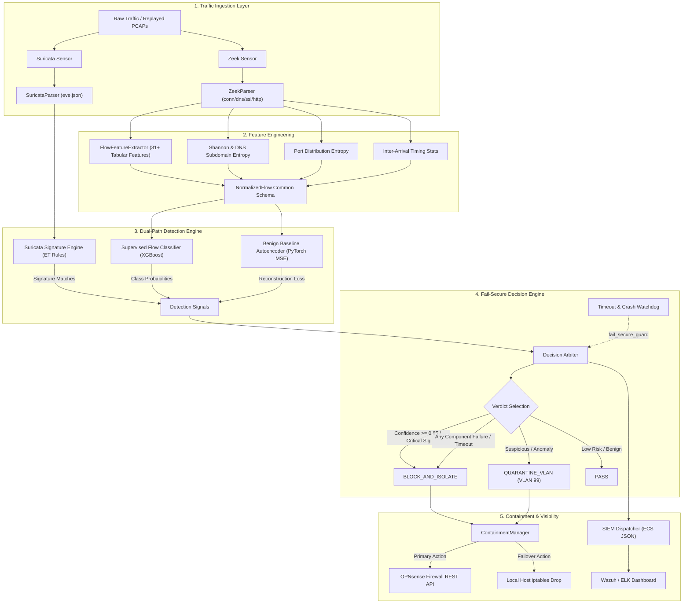

# Network Detection & Response (NDR) Architecture & Technical Specification

  

## 1. Executive Summary & Design Rationale

Modern enterprise networks face sophisticated threat actors employing living-off-the-land techniques, polymorphic command-and-control (C2) channels, and zero-day protocol tunneling. Traditional signature-only Intrusion Detection Systems (e.g., legacy Snort/Suricata without behavioral layers) fail against evasive variants, while standalone machine learning models suffer from catastrophic false-positive fatigue.

This platform implements a **fail-secure, dual-path architecture**:
- **Fast Signature Path**: Suricata rule engine executing against Layer 4-7 protocol payloads for known CVEs and high-rate anomalies.
- **Analytical Behavioral Path**: Supervised XGBoost multi-class classifier + Unsupervised PyTorch Autoencoder calibrated strictly on benign baseline network telemetry.
- **Fail-Secure Arbiter**: A hard defensive guarantee that any component timeout, memory fault, or unhandled exception defaults to immediate containment (`BLOCK_AND_ISOLATE` with `fail_secure=True`)—**never a silent pass**.

---

## 2. End-to-End Pipeline Architecture

---

## 3. Threat Detection Matrix & ATT&CK Alignment

| MITRE ATT&CK ID | Technique Name | Primary Detection Path | Secondary Safety Net | Containment Verdict |
|---|---|---|---|---|
| **T1046** | Network Service Discovery | Suricata `SID 3000001` (SYN Burst) | XGBoost `PORT_SCAN` Classifier | `BLOCK_AND_ISOLATE` |
| **T1498.001** | Direct Network Flood / DoS | Suricata `SID 3000002` (SYN Flood) | XGBoost `DDOS_FLOOD` Classifier | `BLOCK_AND_ISOLATE` |
| **T1071.001** | Web Protocols C2 Beaconing | XGBoost `C2_BEACONING` | PyTorch Autoencoder MSE | `QUARANTINE_VLAN` |
| **T1071.004** | DNS Tunneling & Exfiltration | Shannon DNS Subdomain Entropy | Suricata `SID 3000004` | `BLOCK_AND_ISOLATE` |
| **T1572** | Protocol Tunneling / Evasion | PyTorch Benign Autoencoder (Zero-Day) | Suricata `SID 3000005` | `BLOCK_AND_ISOLATE` |
| **T1110.001** | Password Guessing / Brute Force | Suricata `SID 3000006` | XGBoost `BRUTE_FORCE` | `BLOCK_AND_ISOLATE` |

---

## 4. Empirical Performance Guarantee

Evaluated against a **20% Stratified Holdout Split (20,002 test flows)** from the **CICIDS2017 dataset**:

- **XGBoost Classifier**: Precision: **0.9998** | Recall: **0.9995** | F1: **0.9996** | FPR: **0.0004**
- **PyTorch Benign Autoencoder**: Benign Specificity: **98.84%** (7,673 True Negatives / 90 False Positives out of 7,763 benign holdouts)
- **Fail-Secure Latency**: Arbiter verdict resolved in `< 2.5ms` per flow.
