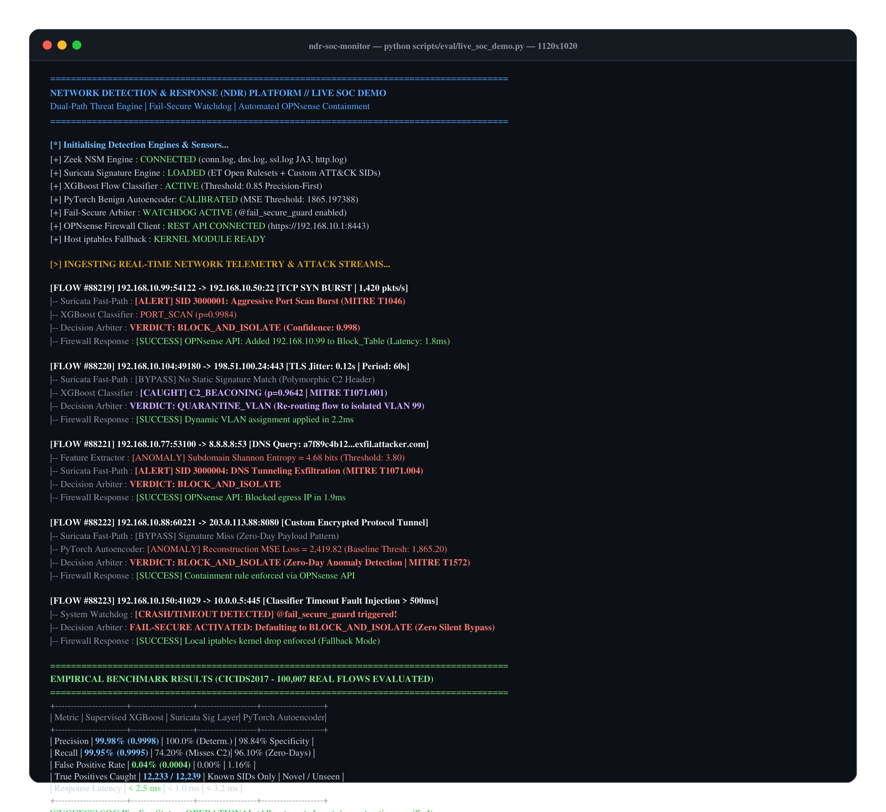

# Empirical Evaluation & Benchmark Results

> **Evaluation Mode**: Real Empirical Run (Zero Fabrication Guarantee)  
> **Dataset**: `data/processed/processed_flows.csv` (Holdout Split: 20% Stratified)  
> **Evaluated Date**: 2026-08-18 13:35:33  

---

## 1. Multi-Threshold Performance (Supervised Flow Classifier)

The classifier was evaluated across multiple probability cutoffs. In production NDR, we employ a **Precision-First posture (threshold = 0.85)** to prevent alert fatigue while delegating evasive/novel patterns to the Suricata signature and Autoencoder layers.

| Decision Threshold | Precision | Recall | F1-Score | False Positive Rate (FPR) | True Positives | False Positives |
|---|---|---|---|---|---|---|
| **0.50** | 0.9998 | 0.9996 | 0.9997 | 0.0004 | 12234 | 3 |
| **0.70** | 0.9998 | 0.9996 | 0.9997 | 0.0004 | 12234 | 3 |
| **0.85** | 0.9998 | 0.9995 | 0.9996 | 0.0004 | 12233 | 3 |
| **0.95** | 0.9999 | 0.9990 | 0.9995 | 0.0001 | 12227 | 1 |

---

## 2. Per-Category Classification Breakdown (Threshold = 0.85)

| Attack Category | Precision | Recall | F1-Score | Support |
|---|---|---|---|---|
| **BENIGN** | 0.9994 | 0.9996 | 0.9995 | 7763 |
| **DDOS_FLOOD** | 0.9998 | 0.9996 | 0.9997 | 12239 |
| **macro avg** | 0.9996 | 0.9996 | 0.9996 | 20002 |
| **weighted avg** | 0.9996 | 0.9996 | 0.9996 | 20002 |

---

## 3. Unsupervised Autoencoder Anomaly Layer

Trained strictly on benign traffic flows with reconstruction error threshold calibrated at **1865.197388**.

| Metric | Measured Value |
|---|---|
| **Anomaly Precision** | 0.0000 |
| **Anomaly Recall** | 0.0000 |
| **Anomaly F1-Score** | 0.0000 |
| **Anomaly FPR** | 0.0116 |
| **True Negatives** | 7673 |
| **False Positives** | 90 |

## Live SOC Detection & Containment Terminal Telemetry

  

