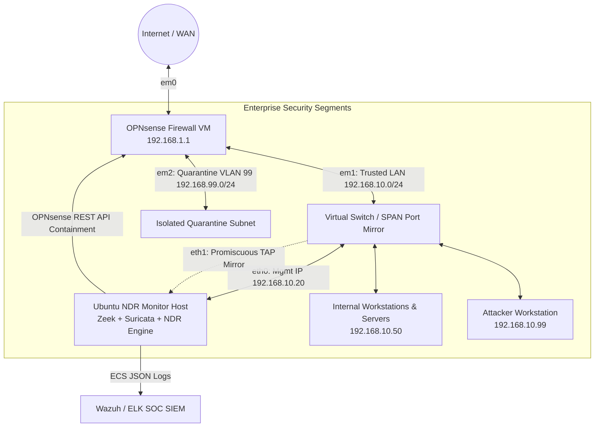

# Virtual Lab Network Topology & Hardware Layout

## IP Subnet Plan
- **Trusted LAN (VLAN 10)**: `192.168.10.0/24` (Gateway: `192.168.10.1`)
- **Quarantine Subnet (VLAN 99)**: `192.168.99.0/24` (Gateway: `192.168.99.1` - No WAN Routing)
- **Monitor Management**: `192.168.10.20`
- **Monitor SPAN / Promiscuous Tap**: `eth1` (No IP assigned, promiscuous mode active)
